# Onsite Tracks: Requirements for Competitors

**Competitors of IPIN are required to code an Android application designed for smartphones** (no tablet are allowed) that:

-computes the location of the target user during the measurement session

-reports the estimated position twice per second to the measurement application (aka the StepLogger app).

**Remember: Test your localization app + StepLogger with a testing path of 15+ minutes so that to ensure the robustness of your localization app.**

We release 3 Android-based applications:
- [StepLogger](https://github.com/wnlab-isti/steplogger/releases/tag/v1.0.0)
- [StepLogger in full-screen mode](https://github.com/wnlab-isti/steplogger_fullscreen/releases/tag/v1.0.0)
- [StepLoggerClient](https://github.com/wnlab-isti/steplogger_client/releases/tag/v1.0.0)

`StepLogger` implements 2 operations:
- a logging service designed to log the position computed by applications of the competitors, and to log the timestamp when you press the buttons shown by the app
- a GUI to perform the measurements. We provide 2 versions of the StepLogger:
	- [designed to run as overlay app](https://github.com/wnlab-isti/steplogger/)
	- [designed to run on foreground and in fullscreen mode](https://github.com/wnlab-isti/steplogger_fullscreen)

`StepLoggerClient` implements only one operation: a testing localization system generating fake positions and invoking the logging system of the `StepLogger` application.

Installing and testing `StepLoggerClient` + `steplogger` will allow you to reproduce the setup we will use during the IPIN competition.

## The AIDL logging interface

We describe in this section the mechanism used to let `StepLogger` communicate with the applications of the competitors.

`StepLogger` implements and exports a simple service, implementing the following Java-method:

	void logPosition(in long timestamp, in double x,in double y, in double z);

This method must be invoked through the [AIDL](https://developer.android.com/guide/components/aidl) interface. In particular, competitors are required to add the `StepLogger` AIDL file to their Android project and invoke the `logPosition` method **twice per second** so that to log the estimated position with a frequency of 2Hz.

Every time the `logPosition` method is invoked, StepLogger logs the following information:

- Time stamp: time in milliseconds from the Unix epoch, as returned from the `currentTimeMillis()` method provided by the Java System class;
- Coordinates `x, y, z` : `x` and `y` are longitude and latitude, respectively, with WGS84 reference system, while `z` is the floor, that is an integer number, with a 0 indicating the ground floor.

These informations are stored in the file `positions.log`, as detailed below in Section: [StepLogger Logging mechanism](#steplogger-logging-mechanism) 

### How to use the AIDL logging interface
- Download the [AIDL file in the StepLogger project](https://github.com/wnlab-isti/steplogger/blob/main/app/src/main/aidl/it/cnr/isti/steplogger/IStepLoggerService.aidl)
- The AIDL file must be placed on the `aidl` folder under your Android project

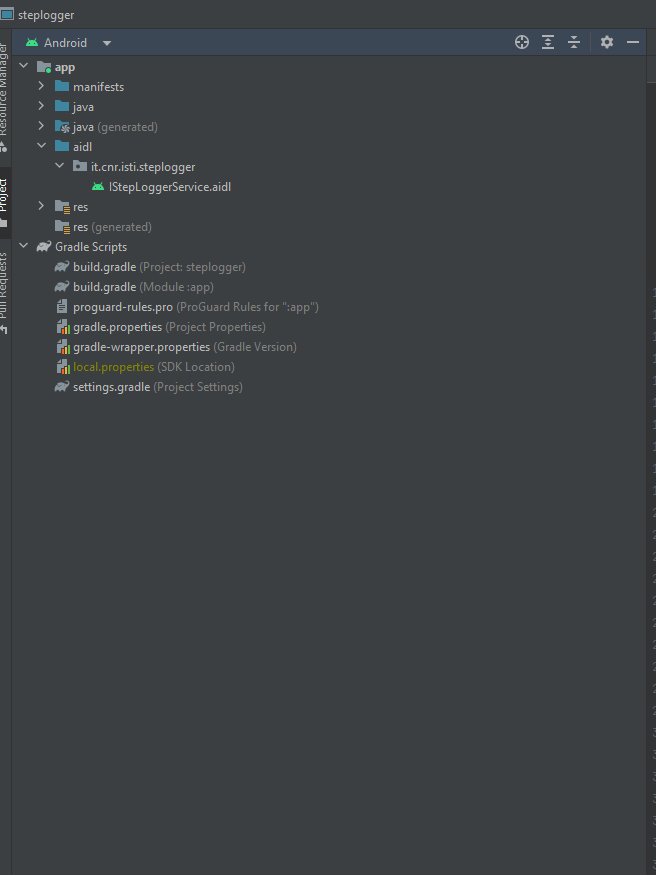

- Add the AIDL file under the Java package: `it.cnr.isti.steplogger`
- If your application is built with API Level 30 and above, declare that you're using the StepLoggerService in your `AndroidManifest.xml`:
		
		<queries>
  			<package android:name="it.cnr.isti.steplogger" />
		</queries>

- Invoke the `logPosition` method by following these steps:
	- Create an Intent object
	- Set the class name of the intent object with:
		
			BOUNDSERVICE_PACKAGE = "it.cnr.isti.steplogger";
			BOUNDSERVICE_CLASS = ".StepLoggerService";

- Invoke the `bindService(…)` method provided by Android OS in order to bind to the service that matching with `BOUNDSERVICE_PACKAGE` and `BOUNDSERVICE_CLASS`

		void bindService(in Intent intentService, in ServiceConnection mConnection, in int flags);

Now you can test the interaction between `stepLoggerCLient` and `StepLogger` or your own application:

- Start the `stepLoggerCLient` app. This app is designed to provide an **example** of how the competing application should interact with the StepLogger. `StepLoggerClient` shows a GUI with two buttons: `START LOGGING POSITION` and `STOP LOGGING POSITION`.

Note: Since `StepLoggerClient` invokes a method provided by the `StepLogger` app, you have to first start a new measurement session.

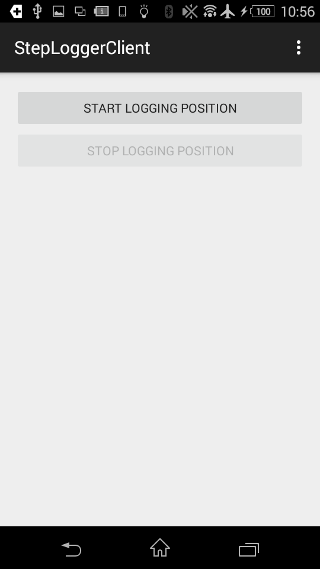

When you click on `START LOGGING POSITION`:
- The `StepLoggerClientActivity` creates an intent object and it sends the intent to the `StepLoggerClientService`
- The `StepLoggerClientService` manages the intent received with the following steps:
- It creates an intent for invoking the `logPosition` service:
	
		if (intent != null) {
			intentService.setClassName(BOUNDSERVICE_PACKAGE, BOUNDSERVICE_PACKAGE + BOUNDSERVICE_CLASS);
		}

- It binds to the service with the Android system call:

		bindService(intentService, mConnection , Context.BIND_AUTO_CREATE );

- It invokes twice per second the `logPosition` with coordinated of x,y and z randomly generated:

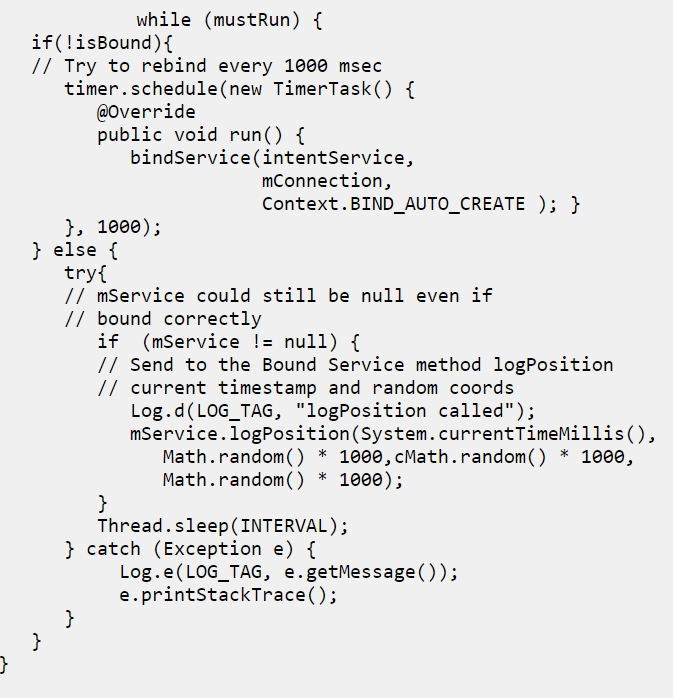

## StepLogger and StepLogger full screen mode

`StepLogger` implements a simople GUI designed to perform measurement sessions. We release 2 versions of `StepLogger`:

- `StepLogger`: designed to run with an overlay interface, in order to allow other apps to run on foreground. This version is usefull to those competitors requiring to have their own app running on foreground.
- `StepLogger full screen`: designed to run on foreground only. The app shows a full screen button with the name of the label as described below

The actor, namely the person in charge of using the application of the competitors, will walk along a predefined path within the evaluation site and he/she will click the button displayed by StepLogger when stepping over the markers placed on the floor. The button displayed on the screen reports the same label of markers on the floor, so that the actor can double-check when to press the button (press button X when you step over marker X). Every time the button is pressed, `StepLogger` logs the following information:

- Time stamp: this time is gathered from the clock of the smartphone running `StepLogger`
- The label displayed when the button is pressed

These information are stored in the file `buttonsPressed.log`, please refer to the [StepLogger Logging mechanism](#steplogger-logging-mechanism) section for information about the logs.

s
### How to start a new measurement session

**FIRST**: copy the the [INI](resources/it.cnr.isti.steplogger.config.ini) file under the Download directory of your phone, ex. `/storage/emulated/0/Download/`
- Install `StepLogger` and `StepLoggerClient` applications. Note that: if you use the `.apk` files remember to enable installation from unknown sources in you smartphones, otherwise you smartphone will prevent the installation of third-party applications. Moreover, new versions of Android OS require to allow running applications in overlay mode as shown with the follwing screenshot (italian language). Click on `install anyway` button:

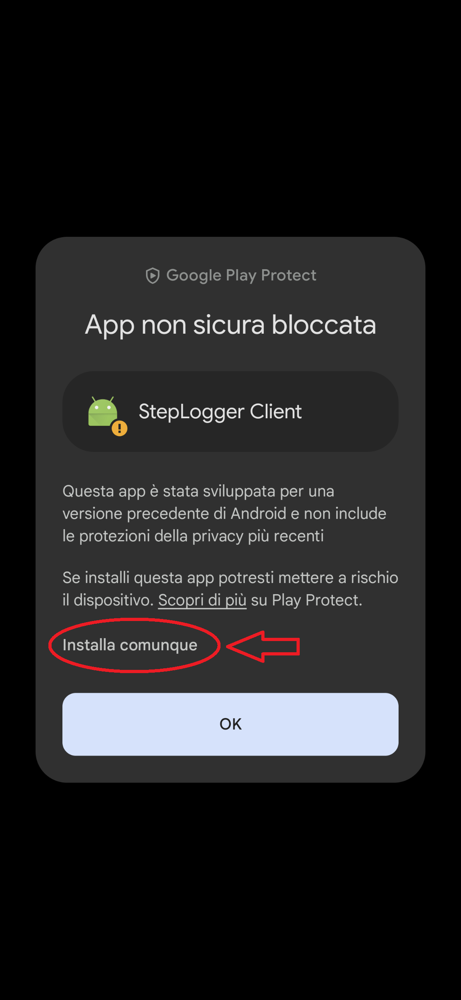

At this point, Android will show you a list of applicataions allowed to run in overlay mode, look for `stepLogger` and enable it, as well:

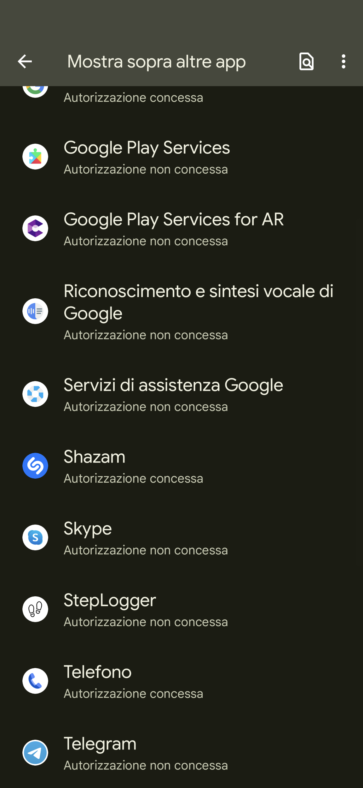

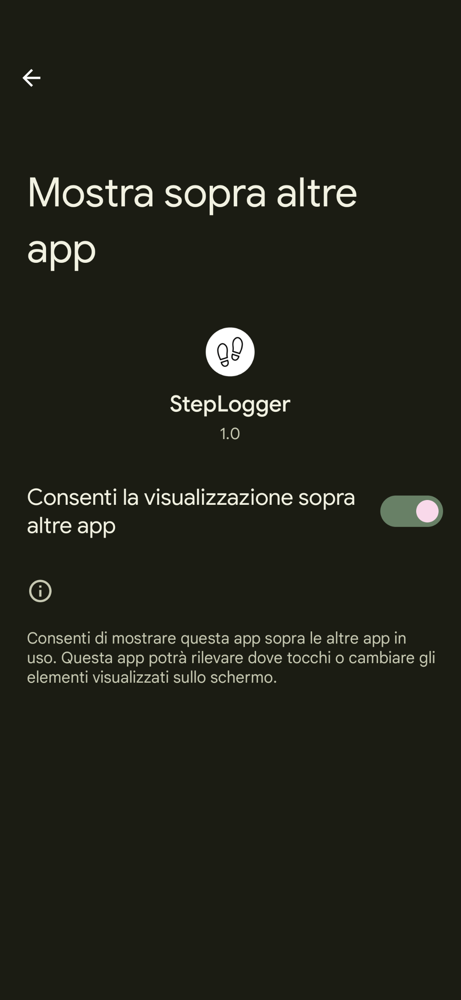

- Look for `StepLogger` and `StepLoggerClient` applications on your smartphone
- Move `StepLogger` and `StepLoggerClient` on the Home page screen
- Run `StepLoggerClient` and click on the button: `Start Logging Position`
- Run `StepLogger` and start a new measurement session:

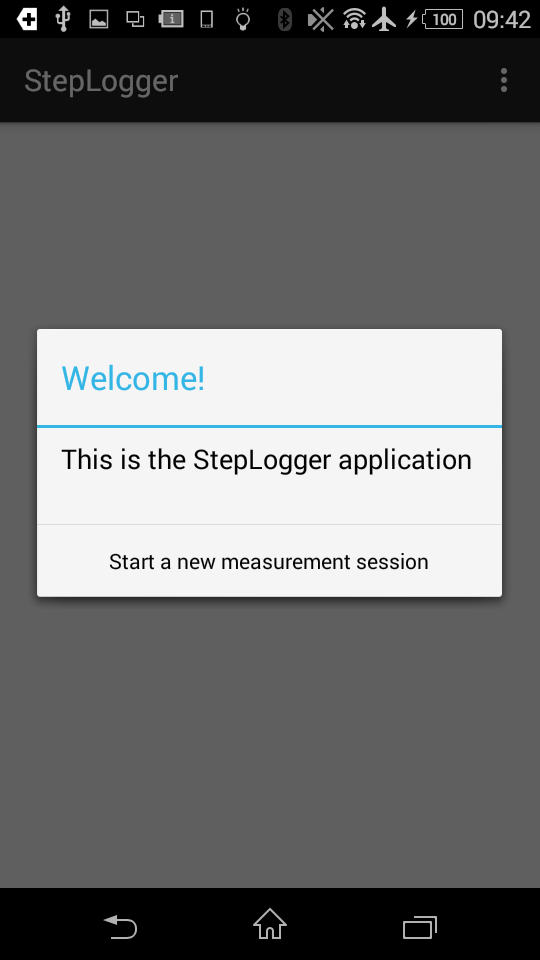

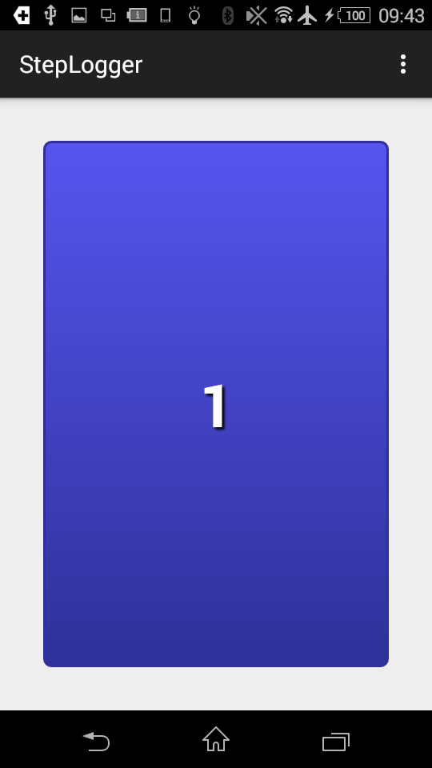

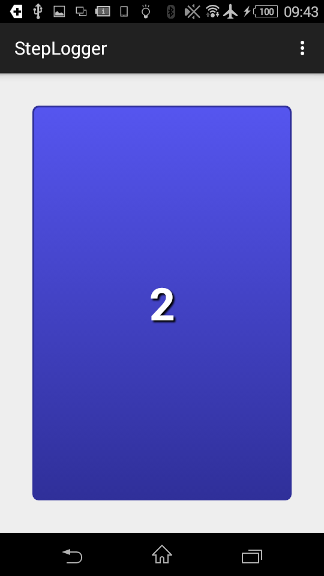

- `StepLogger` updates the logs as soon as you press the button with the label. When you switch to another application and then reopen `StepLogger`, it resumes from the last button pressed.
- After stepping over all the markers, `StepLogger` finalizes the log files and shows a white screen

Some options are available on the top-right menu:

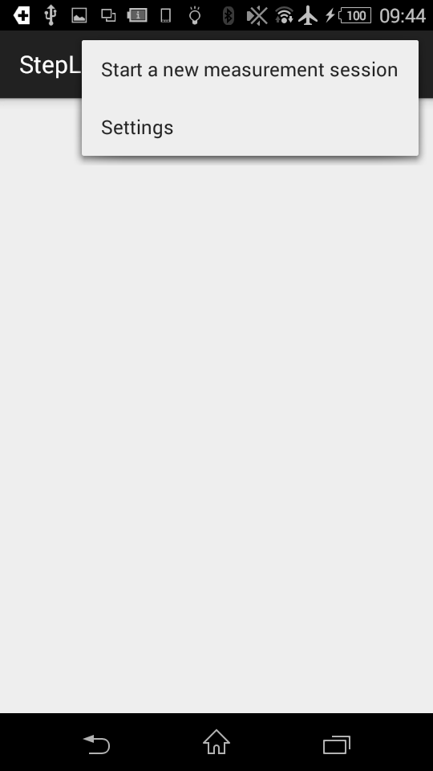

- Settings are available on the top-right menu, it allows to switch to test mode. In test mode StepLogger does not log any file. Note that Test mode should be off during the measurement session

Concerning StepLogger `(overlay)`, all the previous steps are the same. The GUI is slightly different:

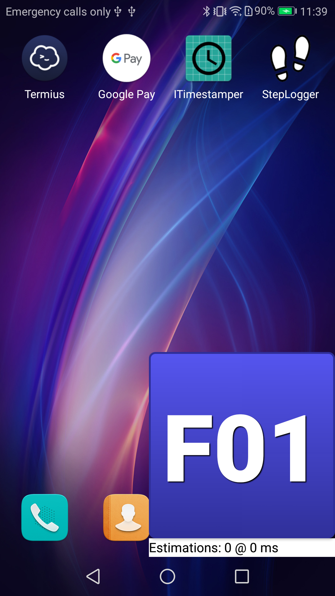

### StepLogger Logging mechanism
`StepLogger` writes the logs generated during the measurement session to the `Download` directory of the devices running `StepLogger`. Inside the `Download` directory, `StepLogger` archives the log files in the folder named: `it.cnr.isti.steplogger`. For example the full path of the smartphone used for tests is:

	storage/sdcard0/Download/it.cnr.isti.steplogger/

Within the folder `it.cnr.isti.steplogger/` `StepLogger` creates a folder for every measurement session, the logs are placed in folder whose name follows this convention:

	[YearMonthDay]T[HourMinutesSeconds][Competitor ID]

The following image shows an example of the names assigned to the folders for the measurement sessions.

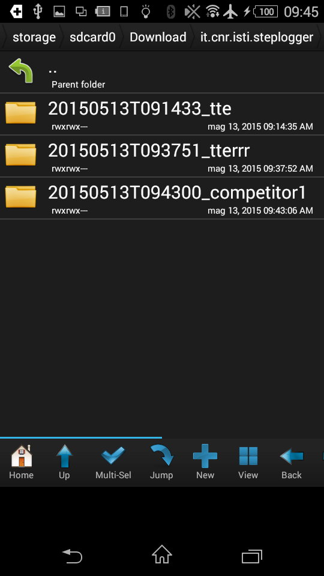

Every folder contains the logs of the measurement session(s) related to the `Competitor ID`. For every measurement session `StepLogger` creates two files:

- `buttonsPressed.log`: logs the time stamp and the label of the button pressed
- `positions.log`: logs the time stamp and the position (x,y,z) notified by the application of the competitors

[Example of logs to download](resources/logs.zip)

## Some Notes

- `StepLogger` is the logger application offering a logging system for your localization application by means of AIDL interface
- `StepLoggerClient` is an example of localization system generating fake positions and invoking the logging system of StepLogger. In order to avoid confusion run `StepLoggerClient` OR your localization application, not both of them at the same time

- Code your localization application so that it is possibile to :
	- halt the system
	- stop invoking the AIDL interface

 
For any question that might be potentially of interest for all the competitors use the mailing list: <contest@evaal.aaloa.org>
